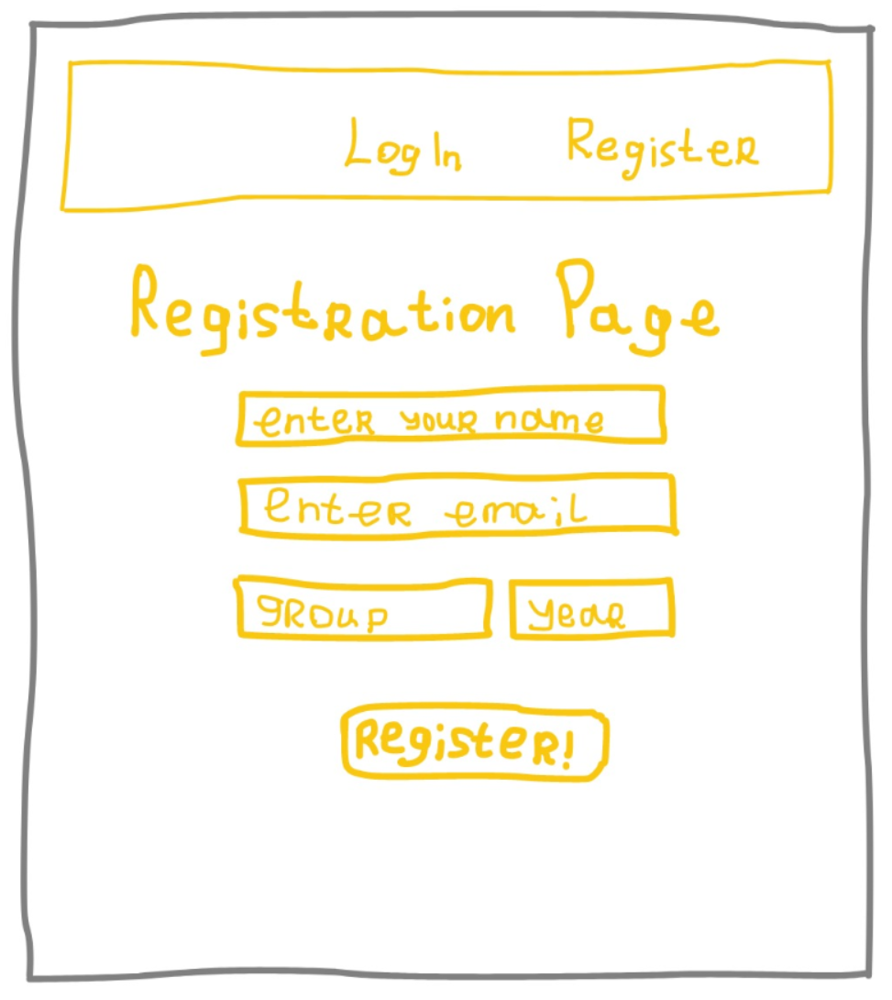
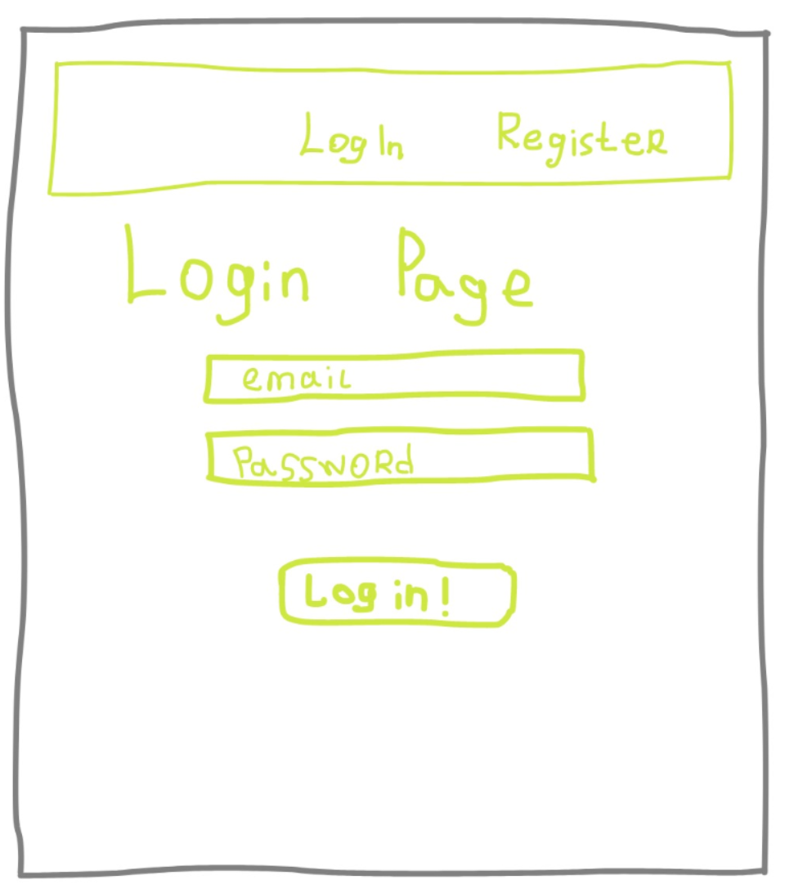
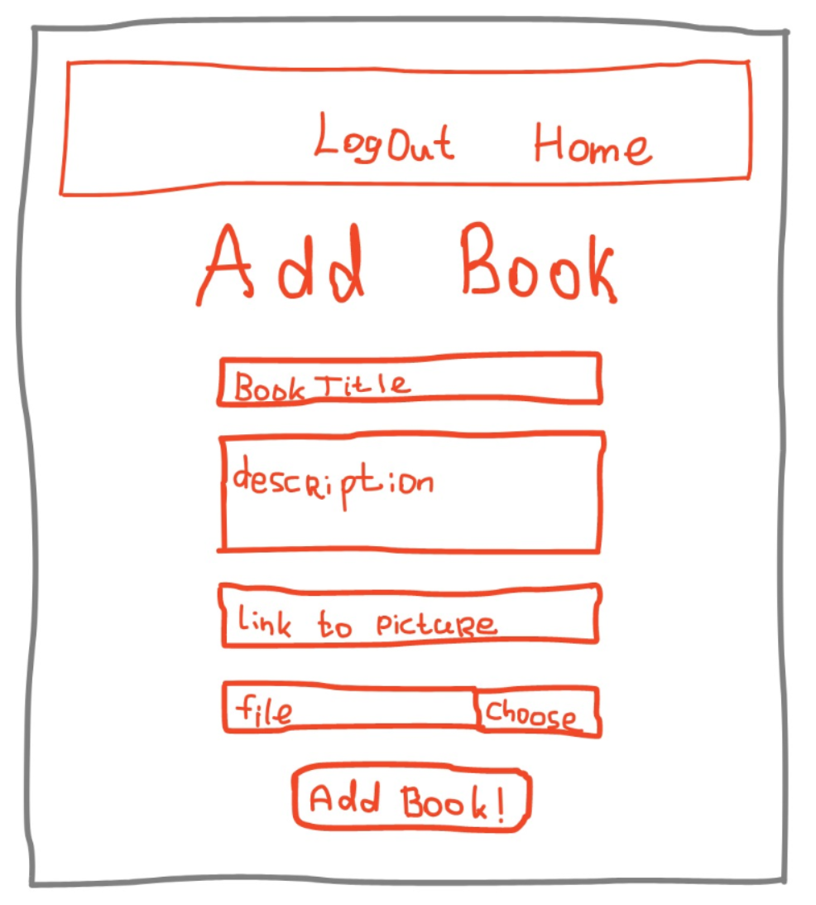
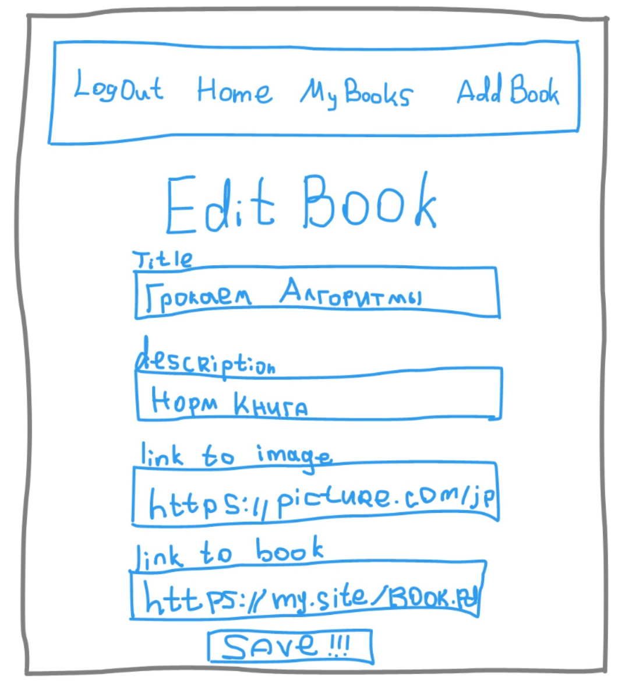
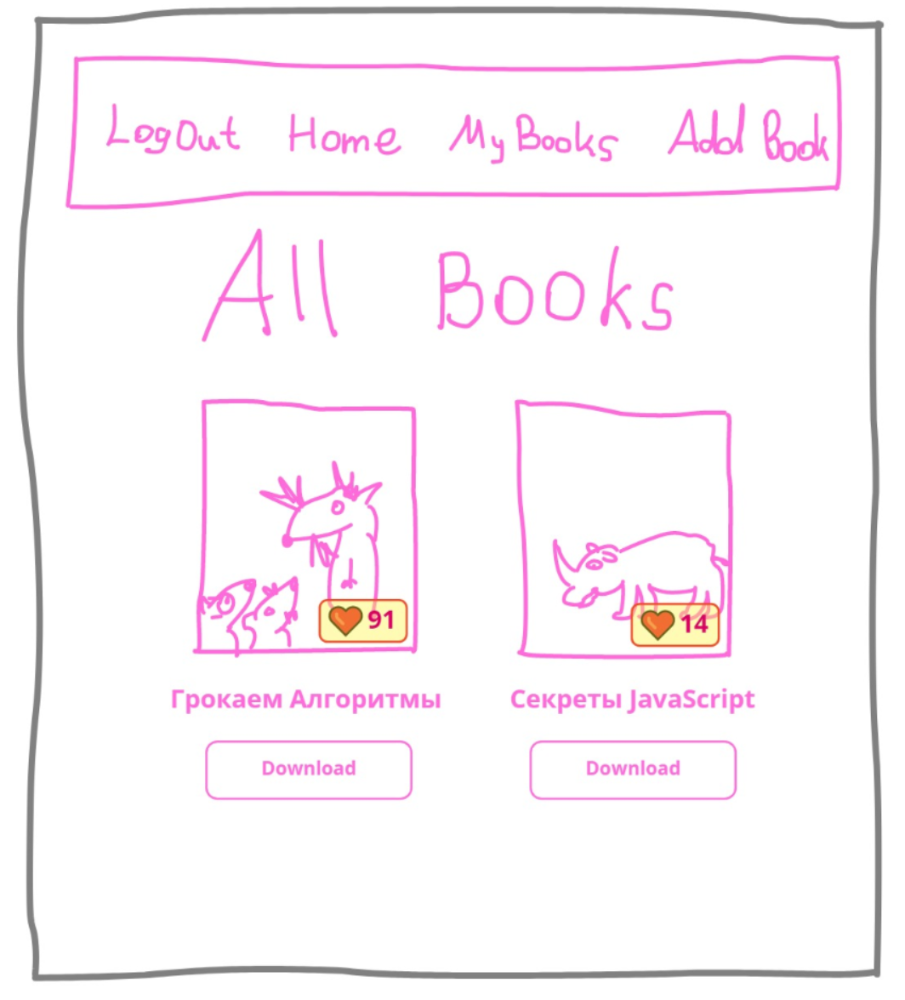

# Exam: Библиотека Эльбрусовца

### Введение
Тебе предстоит создать приложение электронной библиотеки. Пользователи твоего приложения смогут регистрироваться на сайте и добавлять книги, которые они прочитали или хотят прочитать. К этим книгам можно оcтавлять комментарии и ставить лайки. А еще было бы здорово иметь возможность загружать книгу на сервер, чтобы зарегистрированные пользователи могли ее скачать.
<!-- Старайся применить по максимуму все изученные конвенции и стандарты. -->

*Важно:*
Делай  `git push`  только один раз (в 16.00), в течение экзамена ничего пушить не нужно!

**Сначала прочитай всё задание целиком!**

Если не получается сделать какой-то релиз, переходи к следующему.

### Pre-release: Setup
Убедись, что в твоем проекте есть файл .gitignore, package.json и установлены все необходимые библиотеки. Создай базу данных. Проинициализируй eslint.

### Release 0: User Registration
Первое, что нужно сделать - это регистрация пользователей. Не забудь про шифрование паролей. Ты можешь использовать для этого [sha256](https://www.npmjs.com/package/sha256) или более продвинутую библиотеку [bcrypt](https://www.npmjs.com/package/bcrypt). Называй свои routings в стиле REST. Тебе поможет вот эта статья на Хабре: [REST API Best Practices](https://habr.com/post/351890/)

Добавь в шапку сайта ссылки на регистрацию и на домашнюю страницу. Реализуй регистрацию. У каждого пользователя обязательными полями будут **имя**, **email** и **пароль**. Поскольку, это приложение для студентов и выпускников Эльбруса, добавьте возможность указать при регистрации **название группы** и **год выпуска**. email должен быть уникальным у каждого пользователя. При регистрации пользователь выбирает в выпадающем меню свою группу: **Орлы**, **Совы**, **Пчёлы**, **Медведи**, **Еноты**, **Лисы**, **Волки**, **Бобры** или **Ежи**. Год выпуска можно выбрать в диапазоне от 2018 до 2077. Если регистрация не удалась - пользователь должен быть оповещен об этом. Если она прошла успешно - пользователь **автоматически входит в систему** и перенаправляется на домашнюю страницу. Ссылка на регистрацию в меню заменяется кнопкой logout.

  
*Рисунок 1*. Форма регистрации.

### Release 1: Login/Logout
Добавь в шапку сайта кнопку "login", ведущую на соответствующую страницу. Не забудь обрабатывать ошибки: если у пользователя не получается залогиниться - ему нужно знать причину. При успешном входе - вместо кнопки "login" должна появляться "logout". При нажатии на logout пользователь выходит из системы и оказывается на домашней странице. На данном этапе домашняя страница может быть пустой, позже на ней будут отображаться все книги, добавленные пользователями.
  
*Рисунок 2*. Login, logout.

### Release 2: Add Books
Теперь сделай функционал для авторизованных пользователей, позволяющий добавлять книги на сайт. Создай страницу с формой добавления книги, обработчик (handler) на сервере и соответствующую модель в Sequelize. У каждой книги обязательно должны быть **название, описание, обложка**(можно в виде ссылки на картинку). В случае успешного сохранения пользователь перенаправляется на главную страницу.
Добавь ссылку на добавление книги в навигационное меню в шапке сайта.

*Совет: в качестве обложки для книги можно использовать заглушку с [picsum.photos](https://picsum.photos/) или [placeholder.com](https://placeholder.com/)*

  
*Рисунок 3*.  Добавление книги

### Release 3: List Books
Сделай так, чтобы на главной странице были видны все добавленные книги с фотографиями и названием.

### Release 4: I love this book!
Добавь кнопку "like" и счетчик лайков к каждой книге на странице с книгами. После нажатия на эту кнопку количество лайков этой книги должно увеличиться на 1. Эта функция должна быть доступна только авторизованным пользователям. Проследи за тем, чтобы пользователи не могли лайкать одну и ту же книгу больше одного раза.
  
*Рисунок 4*. Все книги всех пользователей

### Release 5: Where is my books?
Добавь кнопку "my books" к навигационному меню в шапке сайта. Эта кнопка доступна только авторизованным пользователям и ведет на страницу с книгами, которые добавил **этот пользователь**. 

  
*Рисунок 5*. Книги пользователя

### Release 6: Updating Books
Возможно, пользователи захотят переименовать свои книги или изменить их описание. Добавь в свой проект функциональность, которая позволит это делать.
Добавь на странице с книгами ссылки `edit` к каждому элементу. По нажатию на эту ссылку должна открываться форма редактирования всех свойств выбранной книги:

  
*Рисунок 6*. Редактирование книги

### Release 7: Deleting Books
Если книга разочаровала читателя, он захочет ее удалить. Добавь кнопку `delete` к каждой книге. После удаления книги она должна исчезать со страницы с книгами и из раздела "My Books".
  
*Рисунок 7*. Книга с кнопками удиления и редактирования

*Не забывай, что кнопки **"edit"** и **"delete"**  должны быть только у авторизованных пользователей, при чем только на собственных книгах. Юзеры не могут отредактировать или удалить не свою книгу.*

### Release 8: Can I get this book?
Сделай так, чтобы при добавлении книги на сайт, можно было залить файл с книгой на сервер. Добавь нужное поле в форму добавления книги, подготовь схему и модель соответствующим образом, измени hbs-шаблон книги так, чтобы в нем была кнопка "Download", повзволяющая скачивать книгу с сервера.

***Примечание:***
*Возможно, для загрузки книги на сервер тебе понадобится библиотека [express-fileupload](https://www.npmjs.com/package/express-fileupload) или [Multer](https://www.npmjs.com/package/multer). Кнопка "Download" - не что иное, как прямая ссылка на книгу, лежающую на сервере в общудоступной директории*

  
*Рисунок 8*.  

### Release 9: Comments
Авторизованные пользовтели могут оставлять комментарии под книгами. Для того чтобы перейти к комментариям, книга должна быть кликабельна и при клике на нее пользователь попадает на страницу книги с фотографией, описанием и комментариями. Так же на этой странице должна быть форма, с помощью которой пользователь может оставить комментарий. Желательно, чтобы комментарий добавлялся без перезагрузки страницы.

  
*Рисунок 9*. Страница книги с комментариями

### Release 10:  Appropriate Behaviors per User and Route
Проанализируйте функциональность, которую вы уже реализовали. Все ли сделано верно с точки зрения логики, распределения ролей, удобства пользователя, безопасности?

* Каждый ли пользователь может добавлять книги на сайт, или только те, кто вошел в систему?
* Могут ли неавторизованные пользователи редактировать книги? А по прямой ссылке?)
* Можно ли редактировать чужие книги?
* Могут ли пользователи редактировать и удалять свои книги? А чужие?
* Можно ли поставить лайк книге? Сколько раз?
* А как на счет комментариев?
* У кого есть доступ на скачивание книг?

### Release 10: *
Если ты справился со всеми задачами, добавь в форму авторизации галочку "долгая сессия". Если пользователь поставит эту галочку и авторизуется, его сессия будет храниться на сервере до тех пор, пока он не разлогинится. Если не поставит, то через час придется заново логиниться.

## Conclusion

**Если вы не успели выполнить задание полностью, в любом случае залейте свой проект на github. Сделать это необходимо в 16.00.**

----
